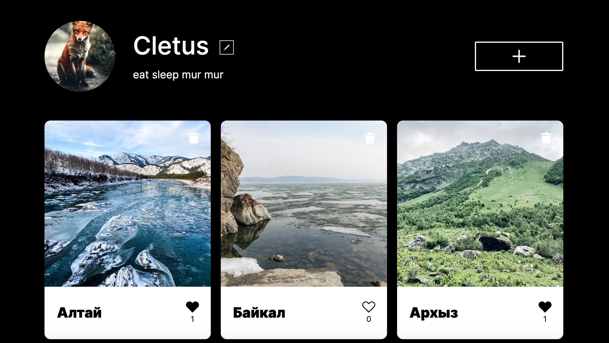

Проект: Место теперь на React.js. 

В проект включены современные способы адаптации сайта под различные мобильные устройства.

Многие блоки могут переиспользоватся. 

JS написан в соответствии с методологией ООП

Технологии которые были использованы:

html css js ООП BEM Адаптивная верстка, сборщик Webpack, API, React

Функционал сайта:

* Попап добавления карточки
* Попап редактирования профиля
* Попап обновления аватара пользователя
* При нажатии на карточку реализовано ее открытие в большом размере.
* Подключены формы отправки
* Добавлена поддержка лайков и дизлайков
* Реализована функция удаления добавленной карточки
* Редактирование профиля и аватара
* Добавление новой карточки
* Cборка проекта с помощью Webpack
* Сайт подключен к серверу

Ссылка на сайт: https://liliakhazieva.github.io/mesto-react/ 